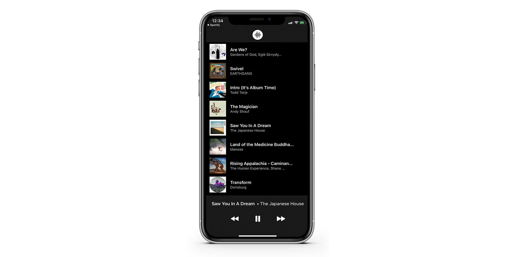

# SwiftMP3

This is a demo project designed to demonstrate modern app programming techniques utilizing SwiftUI and Combine. Leveraging the Spotify iOS SDK and Apple's SF Symbols and Fonts, we are able to easily build a functional MP3 player. 

## Requirements

- A Mac running MacOS Mojave or higher (note: MacOS Catalina is required to take full advantage of Xcode's live preview system for SwiftUI)
- Xcode 11 ([This StackOverFlow post has links to direct downloads of the DMGs from Apple](https://stackoverflow.com/questions/10335747/how-to-download-xcode-dmg-or-xip-file))
- An iOS device running iOS 13 or higher (the Spotify SDK does not run in Simulator)
- The Spotify app installed on that iOS device. You do not need Spotify Premium, to my knowledge (although I have not tested this - if you don't have Spotify Premium and something doesn't work, please open an issue!)
- A free Apple ID. Apple no longer requires you to buy a $99USD/year Developer account, until you want to distribute your apps ([source](https://developer.apple.com/support/compare-memberships/))

## Recommended Tools

- [Fork - Git Client](https://git-fork.com/): Super useful for visualizing your git repository's history and doing your day-to-day git tasks
- [SF Symbols Application](https://developer.apple.com/design/downloads/SF-Symbols.dmg): A tool for MacOS which allows you view all of Apple's free symbols
- [Dash](https://kapeli.com/dash) - Dash is a great way of quickly combing through documentation. It downloads docsets directly to your computer for speedy access. It's a bit pricey (~$30 USD) but worth it if you're constantly checking docs. Alternatively just hit up [developer.apple.com](https://developer.apple.com) for free access to their documentation 
## Setup

- Clone this repository using Git (or simply download it)
- Go the the [Spotify Developer Dashboard](https://developer.spotify.com/dashboard/applications) and create an account + log in
- Click "Create a Client ID". Choose non-commercial use (unless you're gonna make a commercial application out of this - which you can do, if you want, since I've released the code under the [MIT License](https://tldrlegal.com/license/mit-license))
- Name it and give it whatever description you want 
- Set the "Redirect URI" to spotify-ios-quick-start://spotify-login-callback
- Set the "Bundle ID" to a unique identifier that you will be using for your app. Technically, this can be whatever you want, as long as no one else has registered an app with that ID. [The convention Apple recommends](https://developer.apple.com/documentation/xcode/preparing_your_app_for_distribution) is called "reverse-DNS format" (i.e. com.example.mycompany.SwiftMP3)
- Save your changes. Copy your automatically-generated Spotify Client ID
- Open the Xcode project
- Go to Models > Spotify.swift
- Paste your Spotify Client id in the string variable "spotifyClientId" near the top of the class
- Click the blue SwiftMP3 project on the top of Xcode's leftmost pane
- Go to the "Signing &  Capabilities" tab
- Change the Team to your developer account (which you may need to log in to through Xcode's "add an account" option)
- Set the Bundle Identifier to the same identifier that you wrote in to the Spotify Developer Dashboard (it's crucial that they are the same, or this simply won't work)
- Plug in your iOS device, build to it and run!

## What's Next...

I recommend checking out the Views first. Play around with the various views - for example, try making a prettier login page by modifying the LoginView. Or perhaps you want to customize how the songs are displayed in the SongListView.

Here are some useful resources for getting acquainted with SwiftUI, Combine, and the Spotify API:

- [SwiftUI - Apple Developer Documentation](https://developer.apple.com/documentation/swiftui/)
- [Combine - Apple Developer Documentation](https://developer.apple.com/documentation/combine/)
- [Spotify iOS SDK Quickstart](https://developer.spotify.com/documentation/ios/quick-start/)
- [Spotify iOS SDK Reference](https://spotify.github.io/ios-sdk/html/)
- [Swift UI Essentials WWDC 2019](https://developer.apple.com/videos/play/wwdc2019/216)
- [Introducing Combine WWDC 2019](https://developer.apple.com/videos/play/wwdc2019/722)
- [Data Flow Through SwiftUI WWDC 2019](https://developer.apple.com/videos/play/wwdc2019/226/)
- [Combine in Practice WWDC 2019](https://developer.apple.com/videos/play/wwdc2019/721)
- [Hacking with Swift - Learn SwiftUI](https://www.hackingwithswift.com/quick-start/swiftui)
